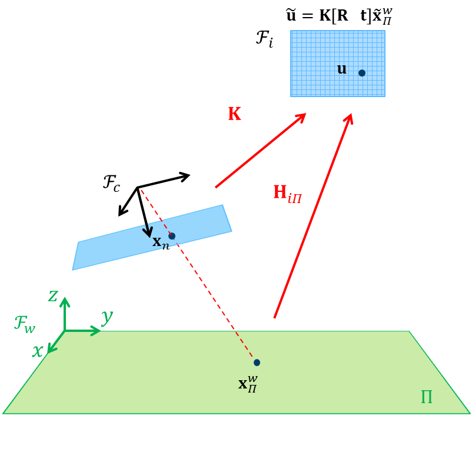

# Step 3: Implement homography-based pose estimation
We will in this part follow [the slides from this week's lecture](https://www.uio.no/studier/emner/matnat/its/TEK5030/v20/forelesninger/lecture_6_1_pose-estimation.pdf) to finish the class `HomographyPoseEstimator`.

You will find `HomographyPoseEstimator` in [lab_pose_estimation.py](../lab_pose_estimation.py)
Read through the code to get an overview. 
Study `HomographyPoseEstimator.estimate()`, and try to understand what is happening here.

Your task is now to implement homography-based pose estimation by performing the necessary computations given in the lecture.

## 2. Construct the world
The world model is constructed from the aerial photo in `create_world_model()` in [lab_pose_estimation.py](../lab_pose_estimation.py)
It is currently set up to construct a world based on the A3 printout. 
If you are using A4 instead, please fix this here.

Else, continue to the next task.

## 3. Compute the **M** matrix
Compute the matrix

## 4. Compute the first two columns of the **R** matrix
Compute the matrix

You can read more about the SVD implementation here:   
https://numpy.org/doc/stable/reference/generated/numpy.linalg.svd.html

## 5. Construct the complete **R** matrix
Complete the **R** matrix by computing the last column, taking the cross product between the first two.
Make sure that det(**R**) = 1.

## 6. Compute the scale *&lambda;*
Compute the scale according to

  
## 7. Find the correct solution
Use *&lambda;* and **M** to compute the translation up to the correct sign.

- We can check if we have the correct solution by testing the last element of **t**.
  - How?

- Choose the other solution if this check fails.

Run and test the pose estimator!

Continue to the [next step](4-experiment-with-motion-only-bundle-adjustment.md) when you are finished testing.
